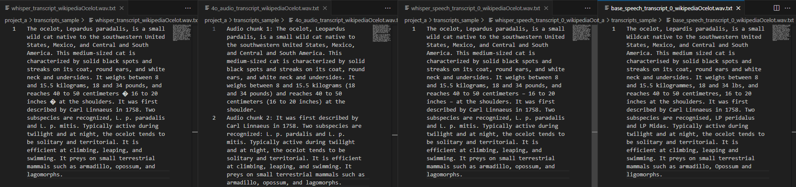

# About

This repo contains demo code for performing audio transcription using Azure AI services.

## project_a

- /scripts/**01_whisper.py**: Speech to text using Azure OpenAI Whisper model
- /scripts/**02_4o_audio.py**: Speech to text using Azure OpenAI gpt-4o-audio-preview
- /scripts/**03_whisper_speech.py**: Speech to text using Whisper model via Azure Speech
- /scripts/**04_base_speech.py**: Speech to text using base model in Azure Speech

_.env_ template and _requirements.txt_ files are included.

_demo_flag_ can be set to _True_ to run the code on included audio sample.

